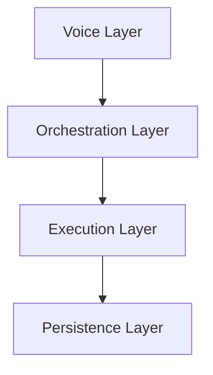

# Orchestra.ai Architecture

This document outlines the major layers that make up the Orchestra.ai platform and how they interact. Each layer can be implemented independently, allowing the system to evolve as new capabilities are added.

## Voice Layer
The **voice layer** provides real-time audio interfaces that connect users to the platform. [Pipecat](https://github.com/sammcj/pipecat) manages the audio pipeline, stitching together services such as Twilio for telephony, Deepgram for speech recognition, and ElevenLabs for text‑to‑speech. These components ensure that spoken input is transcribed and responses are streamed back to callers with minimal latency.

## Orchestration Layer
The **orchestration layer** coordinates reasoning across multiple agents. It is powered by [Microsoft AutoGen](https://microsoft.github.io/autogen/), which enables agent‑to‑agent collaboration, tool calling, and conversation management. AutoGen routes user intent to specialized agents and maintains conversation history so downstream modules can make context‑aware decisions.

## Execution Layer
The **execution layer** carries out actions requested by the orchestrator. It runs LLM prompts, executes tools, and performs domain‑specific logic such as querying the knowledge base or triggering external APIs. This layer is where business rules live and where responses are assembled before being returned to users.

## Persistence Layer
The **persistence layer** captures operational data and long‑term knowledge:

* **Redis** stores transient session state and caches recent interactions for quick retrieval.
* **OpenObserve** collects structured logs and metrics for observability, enabling performance monitoring across voice and orchestration workflows.
* **Label Studio** manages curated transcripts and annotations that feed back into model training and evaluation.

Together these integrations provide durable storage, observability, and a path for continuous improvement of the system.

